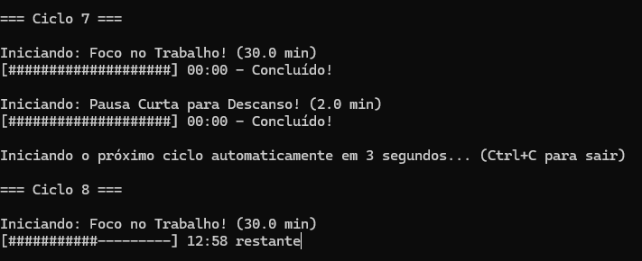

# Pomodoro Script

Script em Python para gestão de tempo com a técnica Pomodoro diretamente no terminal.



## Como Executar

Execute o script utilizando o Python 3:

```bash
python pomodoro.py [argumentos]
```

### Argumentos Disponíveis

- `-f`, `--foco`: Tempo de foco em minutos (padrão: 25)
- `-pc`, `--pausa-curta`: Tempo de pausa curta em minutos (padrão: 5)
- `-pl`, `--pausa-longa`: Tempo de pausa longa em minutos (padrão: 15)
- `-c`, `--ciclos`: Número de ciclos de foco antes de uma pausa longa (padrão: 4)
- `-v`, `--volume`: Nível do volume/intensidade sonora do alarme: 0 a 100 (padrão: 50)
- `-a`, `--auto`: Inicia os próximos ciclos automaticamente sem perguntar

### Exemplos de Uso

**Executar com configurações padrão:**
```bash
python pomodoro.py
```

**Executar com foco de 50 minutos, pausa de 10 minutos, pausa longa de 20 minutos, volume alto (80) e início automático:**
```bash
python pomodoro.py -f 50 -pc 10 -pl 20 -v 80 -a
```

**Execução rápida de teste (ex: foco de 10s e pausa de 5s):**
```bash
python pomodoro.py -f 0.16 -pc 0.08 -pl 0.16
```
